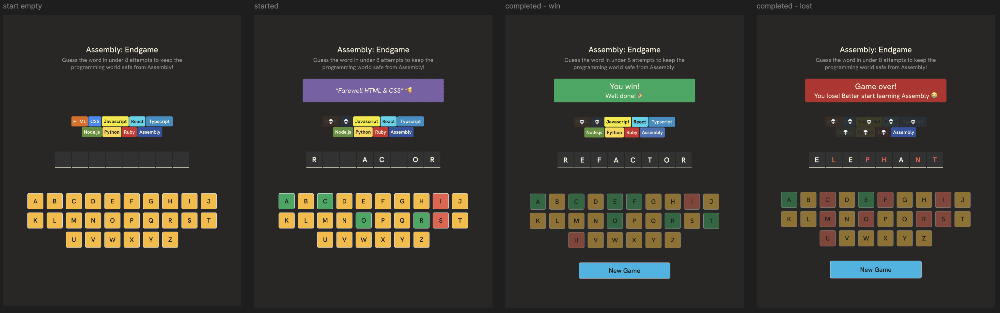

# Scrimba - React Hangman Project
Hangman game built with React for Scrimba's Frontend Developer Program.

## Design

## Requirements
- Generate a word from a dictionary that the user tries to guess.
- Guessing blocks should be done by either keyboard or clicking on the letter in the grid.
- Everytime a user guesses a correct letter, display the letter's location in the word. Also highlight the letter in the grid in green.
- Everytime a user guesses an incorrect letter, eliminate a block. Also highlight the letter in the grid in red.
- If the user guesses all the letters in the word, display winning message
- If the user has guessed wrong too many times and there are no blocks left, display losing message.
- After game is over, display "new game" button, which will reset the game with a new word.
- Don't allow user to type/click characters that have already been guessed.

## Technology
- Uses React
- Built using Vite
- Deployed via Netlify